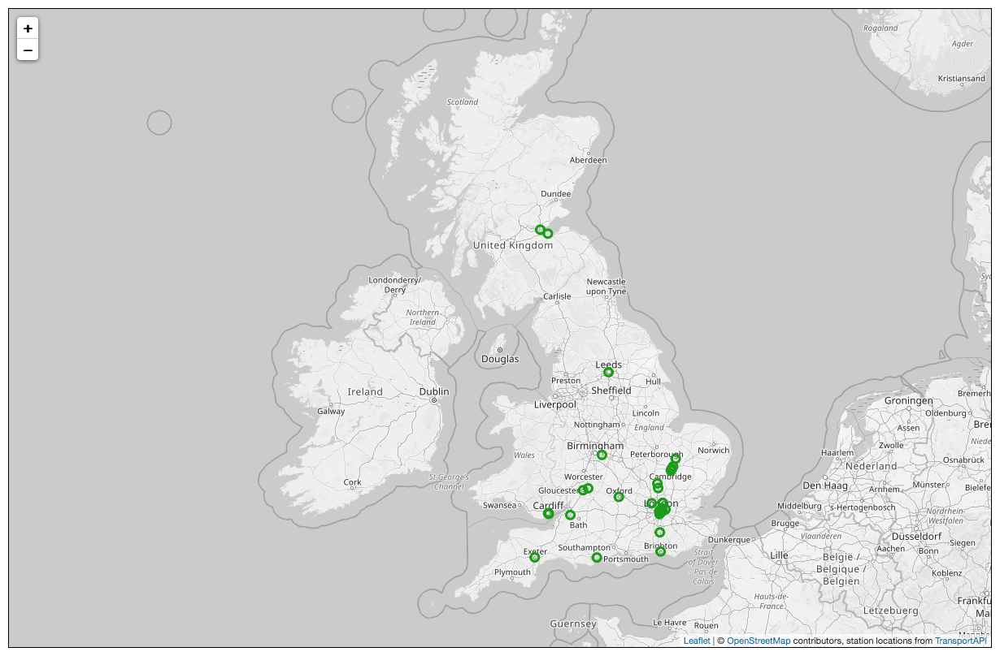

# uk-station-map

This is a quick script I wrote to create a map showing which UK railway stations I've visited:



It uses:

-    ✨ [**OpenStreetMap**](https://www.openstreetmap.org/) ✨ for the map tiles<br/>
-    ✨ [**Leaflet.js**](https://leafletjs.com/) ✨ to render the map and the markers for each station<br/>
-    ✨ [**TransportAPI**](https://www.transportapi.com/) ✨ to get the longitude/latitude coordinates of railway stations

A couple of people asked, so I'm sharing the code here for them to play with -- but reader beware, this was a quick experiment, so it's fairly unpolished code.


## Usage

1.  Clone the repository.

    ```console
    $ git clone https://github.com/alexwlchan/uk-station-map.git
    $ cd uk-station-map
    ```

2.  Create a virtualenv and install dependencies.
    You need Python 3.6 or later.

    ```console
    $ python3 -m venv virtualenv
    $ source virtualenv/bin/activate
    $ pip3 install -r requirements.txt
    ```

3.  Fill in the list of stations you've visited in `stations.txt`.
    These can be full station names or station codes.

4.  Register for an app on <https://www.transportapi.com/>.
    You'll need the app ID and app key to run the script.

5.  Run the script, passing the path to the text file of stations and your Transport API credentials from step 4:

    ```console
    $ python3 get_uk_station_map.py stations.txt --app_id=1234abcd --app_key=5678abef
    ```

    This should render the map, and open it in your browser.
    If any of the stations listed in `stations.txt` are ambiguous, it will ask you to clarify which station you meant.


## Known issues/possible enhancements

*   Transport API doesn't know about every station, in particular it couldn't find [Cambridge North](https://en.wikipedia.org/wiki/Cambridge_North_railway_station).
    I wonder if it's working from stale data?

*   It would be nice to include railway lines.
    You can get that data from [OpenRailwayMap](https://www.openrailwaymap.org/), but I ran into two issues:

    -   No way to filter to just UK lines
    -   The lines are shown in bright orange and red, and I couldn't find a way to change the colours.
        Trying to use those with `L.TileLayer.Grayscale` spewed a bunch of Cross-Origin errors, so I gave up.

*   Have a better way to export the image than taking a screenshot.


## Support

None.

This is a one-off experiment I wrote for fun, not something I want to spend lots of time on.
Requests for support or help to run this code will be ignored.


## License

MIT.
